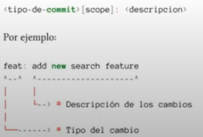
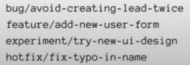

# Curso Git
# Clase 1
## ¿Qué es un controlador de versiones?
Sistema que registra los cambios en el código fuente.
### Importancia de control de versiones
- Rendimiento
- Seguridad
- Flexibilidad
## Historia
- **1990:** Nace CVS precursor de controlador de versiones
- **2005:** Creación de Git
- **2008:** Creación de Github
- **2018:** Microsoft compra Github
- **2024:** Dominación del mercado por parte de Github
## ¿Qué es Git?
Herramienta de control de versiones, siendo un sistema distribuido aloja una copia del repositorio en cada máquina local.
## ¿Qué es un repositorio?
Carpeta donde se almacenan todas las versiones del proyecto.
## Iniciando un proyecto con git
### Uso del comando *git init*
El comando nos ayuda a crear un proyecto nuevo (repositorio local).  
#### Para crear el proyecto desde 0:
***$ git init nuevo-proyecto*** (iniciar proyecto)  
***$ cd nuevo-proyecto*** (ubicarse en el proyecto)  
#### Para iniciar el repositorio de una carpeta ya existente:
***$ cd &lt;directorio del proyecto&gt;*** (ubicarse en proyecto existente)  
***$ git init*** (iniciar el repositorio)
#### ¿Cómo saber si lo hice correctamente?
Nos mostrara la rama en la que estamos en el git bash:  

### Uso de *git --help*  
Lista de comandos útiles  

# Clase 2
## Estados de Git
### Existen 3 estados de git:
- **Modified:** El archivo se creo, elimino o ha sido cambiado, este no tiene los cambios confirmados. 
- **Staged:** El archivo se marco como preparado para ser confirmado por el repositorio local.
- **Committed:** El archivo se graba en el repositorio local.
## Staging Area
Cuando añadimos archivos al repositorio local o modificamos los ya existentes, y queremos guardarlo, el primer paso es llevarlos a la staging area, un sector que nos permite confirmar los cambios que realizamos en el repositorio local.  
### ¿Cómo llevar mis cambios a la staging area?
Usamos el siguiente comando, para cada archivo que deseemos añadir a la staging area:  
***$ git add &lt;file name&gt;***  
Si queremos llevar todos los cambios producidos:  
***$ git add .***  
### *Git restore --staged &lt;file name&gt;* 
Nos ayuda a remover un archivo de la staging area.
## Commit y su importancia
Registra los cambios producidos en el repositorio  
Al tener la perspectiva de fotografías tenemos que:  
 Clase de Git_GitHub- Scesi - 2 - YouTube.png>)  
Tenemos un punto de restauración si es que nos equivocamos.
### Usando el commit
Para guardar los cambios de la staging area hacemos un commit con el siguiente comando:  
***$ git commit***  
Para añadir un mensaje al commit usamos:  
***$ git commit -m*** *"Mensaje descriptivo del commit"*  
Estos cambios se guardaran en el repositorio local hasta hacer nuevamente un commit con otros cambios.   
### Ver los commits que realize
Usamos el comando:  
***$ git log***  
El cual nos permite ver un registro de los commits que se realizaron hasta el momento.  
  
***$ git log --online*** nos muestra solo los mensajes de commits.  
  
### ***$ git commit --amend -m*** *"Nuevo mensaje de commit"*
Nos ayuda a "sustituir" el mensaje del ultimo commit realizado, considerar que "cambia" el identificador del ultimo commit.
## ¿HEAD qué es?
Es el puntero de referencia que nos indica el lugar actual en el que estamos dentro del repositorio.  

## ¿Qué es una rama?
Bifurcación del punto actual en el que nos encontramos.  
Técnicamente es un nuevo apuntador hacia un commit distinto.  

### Propósito de las ramas
Permite el desarrollo colaborativo y no lineal.
### Creando una nueva rama
***$ git branch &lt;nombre de la rama&gt;***
### Cambiar de rama
***$ git checkout &lt;nombre de la rama&gt;***  
o  
***$ git switch &lt;nombre de la rama&gt;***  
También tenemos que para cambiar constantemente entre 2 ramas, una rama previa:  
***$ git switch -***  
### Para hacer los 2 anteriores pasos a la vez
***$ git switch -c &lt;nombre de la rama&gt;***  

Considerar que al crear una nueva rama esta tendrá los cambios del ultimo commit que se hicieron.  
Considerar que las ramas serán visibles en el ultimo commit que se hicieron  
  
# Clase 3
## Ramas
### Fusión de ramas
Las bifurcaciones tienen 2 destinos: El olvido o la fusion con otra rama.  
Al decir fusión nos referimos a la integración de cambios de una rama a otra, para que los cambios de una rama se asimilen con otra rama.
#### ***$ git merge &lt;nombre de la rama&gt;***  
Usamos este comando para incorporar cambios de otra rama en la que estamos actualmente.  
  
Al hacer ***git merge*** por defecto se hace un nuevo commit con todos los cambios de la rama de origen a la rama actual.
#### Otros comandos útiles:
***$ git merge &lt;nombre de la rama&gt; --edit :*** Abre un editor antes de hacer commit  
***$ git merge &lt;nombre de la rama&gt; --no--commit :*** Evita que se realize un commit automáticamente.  
***$ git merge &lt;nombre de la rama&gt; --no-ff :*** Evita que se realize un fast forward y fuerza el commit de merge de ramas.  
### Eliminación de ramas
La razón principal es que es una buena practica, las ramas tienen un tiempo de vida acorde a la realización de su objetivo.
#### Comando: ***$ git branch --delete &lt;nombre de la rama&gt;*** 
Usamos este comando para eliminar ramas sueltas y que ya cumplieron su propósito (o unirse a otra rama), también podemos abreviar el comando con:  
***$ git branch -d &lt;nombre de la rama&gt;***  
Si la rama ya hizo merge con otra no habrá problema, sin embargo si no ocurrió esto ultimo nos devolverá un error:  
Podemos forzar la eliminación usando el siguiente comando:  
***$ git branch -D &lt;nombre de la rama&gt;***  
### ***$ git rebase &lt;nombre de la rama objetivo&gt;***
Rebase es un comando que nos ayuda a reubicar la secuencia de commits de la rama actual a una rama objetivo para reescribir el historial de commits.
### Conflictos en Git
Suceden cuando queremos fusionar cambios en las mismas lineas de un fichero de diferentes ramas, esto se da ya que Git no sabe que cambio prevalecerá en la fusion y nos pedirá que resolvamos este.  
  
#### Resolver conflictos
Tenemos 2 opciones, usar Visual Studio Code o abrir un editor de texto con el comando ***$ git diff***, tenemos un formato ya establecido que nos explica los conflictos:  
<<<<<<<HEAD (Cambio actual)  
Los cambios de la rama actual  
\=========================  
Los cambios de la rama seleccionada por merge  
\>>>>>>\<Rama seleccionada>(Cambio entrante)
# Clase 4
## GitHub
GitHub no es lo mismo que Git, GitHub es un servicio de alojamiento en la nube basado en Git y Git es el controlador de versiones.  
### ¿GitHub como único servicio?
No, existen mas servicios como Bitbucket, GitLab.
## Repositorios remotos
Son repositorios alojados en un servidor y estará sujeto a sincronización con el repositorio local.
## Características que ofrece GitHub
### Mi Perfil y mis repositorios
Estadísticas, contribuciones que hacemos a nuestros y otros repositorios.  
Visualización de la cantidad de repositorios propios (tienen un limite) y en los que participamos.
### Buscar otros perfiles y repositorios
Podemos ver las estadísticas de otros perfiles, su actividad, sus repositorios públicos, organizaciones a las que pertenece.
### Proyectos
Herramientas de gestión de proyectos, flujos de trabajo, creación y asignación de tareas a integrantes del proyecto.
### Repositorio > Actions
Nos ayuda con DevOps, deployment del repositorio, la seguridad, integración continua.  
Nos permite automatizar gran parte y diferentes areas del repositorio
### Organizaciones
Nos permiten tener una comunidad que comparte repositorios propios de la organización.
## Enlazar un repositorio local con uno remoto
Usamos el siguiente comando en git bash:  
***$ git remote add \<alias>*** (usualmente el alias es "origin") ***\<url del repositorio remoto>***
### Generar llaves SSH
Las llaves se usan para autenticar la identidad de un contribuyente, evitan las suplantaciones de identidad.  
#### Pasos:
Listado de nuestras llaves:  
***$ ls -al ~/.ssh***  
Crear llave SSH:  
***ssh-keygen -t rsa -b 4096 -C "tu.email@email.com "***  
***press enter***  
***passphrase***  
Poner en marcha la llave:  
***eval "$(ssh-agent -s)"***  
Añadir la llave:  
***ssh-add ~/.ssh/id_rsa***  
Copia en portapapeles:  
***clip < ~/.ssh/id_rsa.pub***  
Pegar en sección "key":  
***https://github.com/settings/ssh/new***  
### Clonación de repositorios
Usamos el comando en git bash:  
***$ git clone <dirección HTTPS del repositorio terminado en ".git">***  
### Realizar cambios en el repositorio remoto
Para ir modificando el remoto debemos escribir el siguiente comando:  
***$ git push \<alias del repositorio remoto> \<rama a la cual enviaremos los cambios>***  
### Creación de una rama remota
Usamos el siguiente comando en git bash:  
***$ git switch -c \<rama>***  
También podemos usar esta otra variante:  
***$ git checkout -b \<rama>***  
Este comando crea la nueva rama en el repositorio local.  
Para enviar esta rama al remoto usamos:  
***$ git push \<alias del remoto> \<rama>***  
Considerar que tratar de hacer push a una rama no existente generara un error  

### Eliminar ramas del repositorio local que ya no se usan
Ejecuta el comando:  
***$ git remote prune \<alias del remoto>***  
### ***$ git fetch***  
Nos permite actualizar las referencias del remoto a nuestro local, es precisamente importante hacerlo antes de un *git pull*  
**Nota importante:** Para visualizar la referencia de una rama remota en el local debemos cambiarnos a la rama en cuestión. 
### ***$ git branch -a***  
Nos muestra las referencias tanto de las ramas locales, como de las remotas.
## Push, Pull & Pull Request
### Push
Empujar cambios del repositorio local al remoto.
#### Comandos:
- ***$ git push***  
- ***$ git push --all :*** Actualiza todas la ramas en las referencias correspondientes.  
- ***$ git push -u \<alias remoto> \<rama> :*** Conecta la rama local con la remota, para que se pueda hacer un ***git push*** convencional.
- ***$ git push -f :*** Sobrescribe el historial del remoto con el historial local, eliminando los commits del remoto que no estén en el local.
### Pull
Jalar los cambios del repositorio remoto al local.
#### Comandos:
- ***$ git pull***  
- ***$ git pull --set-upstream \<alias remoto> \<rama> :***  Sincroniza la rama local con la remota.  
- ***$ git pull --all :*** Actualiza todas la ramas en las referencias correspondientes.  
### Pull Request 
Es un solicitud de integración de todos los cambios al repositorio de origen.
#### ¿Cómo hacemos una PR?
Previamente debemos haber hecho un push y entonces:  
1. La rama subida recientemente nos mostrara una opción en GitHub > Code.
2. Ir al apartado GitHub > Pull requests.
#### Buenas practicas para una PR
1. **Enfoque en un solo objetivo:** Las revisiones son menos exhaustivas.
2. **Detallar la PR:** Dar mas información demuestra con claridad la funcionalidad a implementar.
3. **Proporcionar feedback constructivo**
4. **Entender la dimensionalidad y contexto que lleva la PR:** como afecta al proyecto, que cosas son útiles, que cosas podemos agregar.
# Clase 5
## GitFlow
Es el modo de trabajo colaborativo que adopta un equipo, siguiendo las pautas de GitFlow.  
Utiliza las siguientes ramas:  
1. **main :** Tiene el código de producción.
2. **develop :** Tiene el código de pre-producción que todavía no pasa por control de calidad.  
3.  **Feature :** Funcionalidades nuevas.
4.  **Release :** Cambios tardíos.
5.  **Hotfix :** Arregla errores pequeños.  

## GitHub Flow
Tiene la rama **main** como principal y otras ramas que serán integradas por una PR.  
Para hacer uso de este flujo es necesario tener conocimiento de CI/CD.  

## Trunk Based Development
Solo la rama **main** y ramas auxiliares temporales que serán integradas por un PR.  

## Ship/Show/Ask
1. **Ship :** Se fusiona en la rama principal sin revision.
2. **Show :** Petición de cambios para ser revisados por medio de CI, la fusion se da inmediatamente.
3. **Ask :** PR para discutir los cambias antes de la fusion.  
  
Flujo de trabajo sugerido para expertos, que tengan seguridad de subir sus cambios y pleno conocimiento del proyecto.  

### Reglas para Ship/Show/Ask
1. Tener un buen sistema CI/CD
2. Confianza plena en el equipo, todos deben tener buenas practicas de desarrollo y responsabilidad.
3. No es requerimiento la revision de código.
4. Las ramas son pequeñas y de corto tiempo de vida, salen desde la rama principal.
# Clase 6
## Buenas practicas Git
- Estándar manejado por la mayoría de equipos
- Resolver conflictos de manera eficiente.
- Historial de commits mejor organizado.
## ¿Cada Cuanto debemos hacer un commit?
Con alta frecuencia, juntar pequeñas mejoras y cambios es mejor que tener un gran commit.  
Esto tampoco implica hacer commits insignificantes.
## Escribir un buen commit
- Usar verbos imperativos (Add, Change, Fix, Remove).
- No usar puntos finales ni puntos suspensivos.
- Usa un máximo de 50 caracteres.
- Añade contexto de ser necesario al cuerpo del commit.
- Considera usar utilidades.
- Usa prefijos para semántica.  
  

## Prefijos
- `feat`: Nueva funcionalidad.
- `fix`: Corrección de bug.
- `perf`: Mejoras en rendimiento.
- `build` : Cambios en la configuración de build.
- `ci`: Cambios en integración continua.
- `docs`: Cambios en documentación.
- `refactor`: Mejoras en código.
- `style`: Cambios en estilo.
- `test`: Cambios en pruebas.
## Escribir un buen nombre de rama
- Consistencia al nombrar ramas.
- Usa el nombre de la acción que se realiza en la rama:  

- Ayúdate con los IDs de Jira o un sistema de tickets.